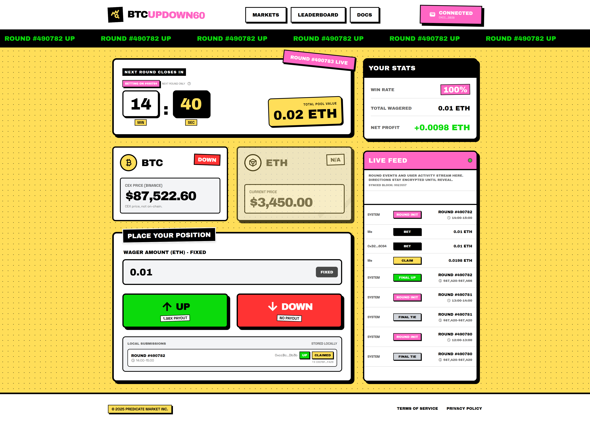

# BTCUPDOWN60 - FHEVM BTC Up/Down Demo 🚀

Quick highlights ⚡
- Simple FHE bet game: bet directions stay private until reveal.
- Fully on-chain + serverless: bet/claim/reveal work via contract calls even if any UI/server is down.
- Chainlink Automation finalizes rounds automatically (anyone can still trigger on-chain finalize; contract guards early reveals).

A privacy-preserving BTC up/down prediction market built with FHEVM. Users bet only on the next 60-minute round. Stake amount is public, while the direction (up/down) stays encrypted until reveal.

Note: the UI shows a CEX BTC price from Binance for display. The on-chain result uses the Chainlink BTC/USD feed.

## Features ✨
- 60-minute rounds with "next round only" betting
- Encrypted directions using Zama FHEVM and Relayer SDK
- Public RPC reads for round state (no wallet required to view)
- Live feed indexing from on-chain events, cached in localStorage
- User stats sourced from contract view functions (getUserStats)
- Chainlink Automation support for automatic round finalization

## Latest Deployment (Sepolia) 🧾
- Contract: `0x5F893Cf33715DbaC196229560418C709F0FFA6Ca`
- Chainlink BTC/USD Feed: `0x1b44F3514812d835EB1BDB0acB33d3fA3351Ee43`
- Public RPC: `https://ethereum-sepolia-rpc.publicnode.com`

## Round Logic 🧠
- Round id is `floor(block.timestamp / ROUND_SECONDS)`.
- Bets are accepted only for `currentRound + 1`.
- Finalization compares `endPrice` (current Chainlink price) vs `startPrice` (previous round end price). If equal, result is Tie.

## Core Flow (On-chain) 🔒

Actors: User, Contract, Chainlink Feed, Automation

1) placeBet(roundId + 1, encDirection, stake)
   - encTotalUp / encTotalDown updated via FHE select
2) finalizeRound(roundId) OR Automation performUpkeep
   - reads Chainlink BTC/USD and sets result (up/down/tie)
3) requestRoundReveal(roundId)
   - emits encrypted total handles
4) publicDecrypt(handles) via SDK
   - obtains cleartexts + decryptionProof
5) resolveTotalsCallback(roundId, cleartexts, proof)
   - totals stored on-chain, fee computed
6) requestClaim(roundId)
   - emits per-user payout handle
7) publicDecrypt(payoutHandle) via SDK
   - obtains cleartexts + decryptionProof
8) claimCallback(roundId, cleartexts, proof)
   - payout transferred

ASCII diagram 1: round timeline + target round ⏱️

```
time ───────────────────────────────────────────────────────────────────────→

t = N*3600                 t = (N+1)*3600                t = (N+2)*3600
|-------------------------|-----------------------------|--------------------|
 Round N active            Round N+1 active              Round N+2 active
 (currentRound = N)        (target = N+1)                (...)
 betting target = N+1      finalize N+1 at endTime

startPrice(N+1) = endPrice(N)
endPrice(N+1)   = Chainlink latest price at finalize
result          = compare(endPrice, startPrice)
```

ASCII diagram 2: on-chain sequence (bet → reveal → claim) 🔁

```
User/Wallet        UI/Client            Contract             Chainlink           Relayer/SDK
    |                 |                    |                     |                   |
    |  place bet      |                    |                     |                   |
    |  (click) ------>| handlePlaceBet     |                     |                   |
    |                 | encrypt direction  |                     |                   |
    |                 |------------------->| placeBet(enc, stake) |                   |
    |                 |                    | enc totals updated   |                   |
    |                 |                    |                     |                   |
    |                 | finalize/keep ---->| _finalizeRoundFromFeed                 |
    |                 |                    |---- latestRoundData ------------------>|
    |                 |                    |<--- price + updatedAt -----------------|
    |                 |                    | result set (Up/Down/Tie)                |
    |                 |                    |                     |                   |
    | request reveal  |------------------->| requestRoundReveal   |                   |
    |                 |<--- total handles--| emit handles         |                   |
    |                 | publicDecrypt(handles) ------------------------------------->|
    |                 |<--- cleartexts + proof -------------------------------------|
    |                 |------------------->| resolveTotalsCallback                    |
    |                 |                    | totals stored + fee set                  |
    |                 |                    |                     |                   |
    | request claim   |------------------->| requestClaim         |                   |
    |                 |<--- payout handle--| emit handle          |                   |
    |                 | publicDecrypt(handle) -------------------------------------->|
    |                 |<--- cleartexts + proof -------------------------------------|
    |                 |------------------->| claimCallback -> payout transfer         |
```

ASCII diagram 3: frontend data sources 📊

```
                         ┌──────────────────────────┐
                         │        Browser UI        │
                         └────────────┬─────────────┘
                                      │
           ┌──────────────────────────┼──────────────────────────┐
           │                          │                          │
   ┌───────▼────────┐       ┌────────▼────────┐        ┌────────▼────────┐
   │ Public RPC     │       │ Binance API     │        │ Wallet + SDK    │
   │ (Sepolia)      │       │ BTC/USDT        │        │ (encrypt + tx)  │
   └───────┬────────┘       └────────┬────────┘        └────────┬────────┘
           │                          │                          │
   round state/totals/result     CEX price label            placeBet/claim
   event logs (feed)             (UI only)                  signed tx
           │                          │                          │
           └──────────────┬───────────┴───────────┬───────────────┘
                          │                       │
                  localStorage cache        Live Feed table
```

## Frontend Data Flow (Read-only) 🌐
- Public RPC polls: current round, round totals, round result
- Event logs: BetPlaced / ClaimPaid indexed and cached locally
- Binance CEX price polled for UI only (not used for on-chain logic)

## Project Structure 🧱
- app/                 Next.js App Router pages and providers
- components/          Reusable React components
- src/lib/             FHEVM helpers and encryption utilities
- hardhat/             Smart contracts workspace (deploy, config, tests)
- fhevm-sdk/           Vendored FHEVM SDK build artifacts
- types/               Global TypeScript declarations

## Deployment 🛠️
1) Set environment variables in `hardhat/.env`:
   - `SEPOLIA_RPC_URL`
   - `SEPOLIA_PRIVATE_KEY`
   - (optional) `FEE_RECIPIENT`, `FEE_BPS`, `MAX_PRICE_AGE`, `STAKE_ETH`
2) Deploy:
   - `cd hardhat && npx hardhat run scripts/deploy-btc-updown.js --network sepolia`
3) Update frontend address:
   - `app/btc-updown/page.tsx` -> `CONTRACT_ADDRESSES[11155111]`
4) (Optional) Verify:
   - `cd hardhat && npx hardhat verify --network sepolia <address> <stakeWei> <feeBps> <feeRecipient> <btcUsdFeed> <maxPriceAge>`

## Development 🧪
Root (Next.js):
- npm install
- npm run dev
- npm run build
- npm start
- npm run lint

Hardhat (smart contracts):
- cd hardhat && npm install
- cd hardhat && npm run compile
- cd hardhat && npm run chain
- cd hardhat && npm run deploy:hardhat
- cd hardhat && npm run deploy:sepolia
